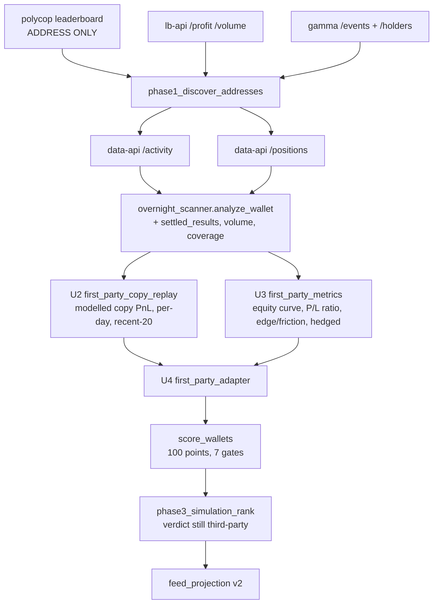

# feat: First-party screener cutover — every judgment derives from Polymarket fills

> **Superseded in two places by [ADR 0014](../adr/0014-modelled-copy-pnl-is-a-full-size-mirror.md).**
> This plan is kept as written, because what it got wrong is part of the record.
>
> 1. **U2 prescribes a bankroll-scaled replay.** Run against real wallets that rejected 17 of 17 on
>    the Slippage Cost Rate gate: against a scaled copy, `(actual − copy)/actual` measures the
>    bankroll rather than the friction. Modelled Copy PnL is a **full-size mirror** at a fixed 2% per
>    side. The plan's own risk section named this as U2's load-bearing assumption; it did not hold.
> 2. **U7 requires the tier bands to be re-measured.** They were measured and deliberately **not
>    moved**: only 3 wallets are scoreable under the current profile, which cannot calibrate an
>    absolute floor. The re-measurement is owed once the scanner has re-run the dataset.

## Goal Capsule

The 100-point audit currently scores wallets on numbers a third-party aggregator computed and
nobody verified. ADR 0012 decided that the aggregator supplies candidate **addresses** and every
judgment derives from first-party fills; `overnight_scanner.py` proved the measurement is possible
and then landed as a side-channel nothing consumes. This plan finishes the cutover: a first-party
measurement path that reaches the engine, gates that read measured traits, and a feed that carries
the provenance.

**Definition of Done:** `phase2_filter_targets` scores wallets from `first_party_adapter`, no
aggregator-computed metric field reaches `score_wallets`, the tier bands are re-measured against the
new distribution, the feed carries the new provenance fields at a bumped version, and the full test
suite passes.

---

## Problem Frame

Three facts set the shape of the work.

**The aggregator's ranking is anti-correlated with copyability.** ADR 0012 measured its 100/100
wallet: median buy price 0.999, 78% of fills at or above 0.95, maximum possible gain 0.1% per fill.
That wallet is uncopyable by arithmetic. The site score rewards win rate, and in a prediction market
win rate is bought by paying 99 cents for a certainty.

**The blast radius is the whole score.** Every one of the ten scored parameters and seven of the
eight hard gates read a field that arrives precomputed from the aggregator, directly or through
`leaderboard_adapter`. There is no partial cutover that leaves a coherent engine.

**The scanner measures the right things and then throws away the evidence.**
`overnight_scanner.py:344` computes `_settled_market_pnl` — a per-market USDC result for every market
whose outcome is known, taking the union of closed cash flows and worthless held positions to defeat
the bias in either feed alone. `analyze_wallet` then reduces that dict to three aggregates
(`settled_pnl_usdc`, `win_rate`, `settled_markets`) and discards the per-market values, their
timestamps, and the traded notional. Those discarded intermediates are exactly what the engine needs.

---

## Conflict with the merge plan's C1 finding — read this first

The merge plan's eng review (finding **C1**) states that three scored parameters are *structurally
unmeasurable* by the scanner as built, and concludes that a drop-and-reweight to 100 is mandatory.
**The code does not support that conclusion.** Reporting rather than resolving silently, per the
standing instruction:

| C1 claim | What the code shows |
| :--- | :--- |
| Drawdown Depth (13) needs a lifetime equity curve — unmeasurable | `derived_metrics.calculate_drawdown_depth` takes any ordered list of cumulative values. The scanner already computes per-market settled PnL; ordering those by close time and running a cumulative sum *is* the equity curve. Measurable. |
| Recent Form (11) needs recent-20 slippage — unmeasurable | The window is the last 20 settled markets, which the same per-market dict supplies. The slip term is *modelled* friction, not observed — `score_wallets` scores it against `RECENT_FORM_SLIP_CEILING_PCT` on the profile's assumed slippage. Measurable. |
| Daily Green Rate (9) needs copy-adjusted per-day PnL — unmeasurable | Copy-adjustment is a function of the Copy Execution Profile applied to fills we hold. It needs a replay, not an aggregator. Measurable via U2. |

The deeper point C1 missed: **`slip_cost_rate` is not a field, it is a derivation.**
`score_wallets.py` computes it as `(actual_pnl - copy_pnl) / |actual_pnl|`, where `copy_pnl` is the
aggregator's Modelled Copy PnL. So one missing quantity — a first-party Modelled Copy PnL — is what
blocks a gate, 17 points of Slippage Cost Rate, 11 points of Recent Form, and 9 points of Daily
Green Rate at once. Producing it locally (U2) unlocks 37 points and two gates in a single module.

**Consequence for the plan:** every one of the ten scored parameters gets a first-party substitute.
No parameter is dropped, so **no reweight is required** and the 100-point total is preserved. Only
the PolyCop Site Score *gate* is removed, and it carries zero points. Tier bands must still be
re-measured (U7) because the input distribution changes, but the band re-measurement is a
recalibration, not a rescue from a lowered ceiling.

If this reading is wrong, U2 is where it breaks, and U2 is sequenced early for that reason.

---

## Requirements

- **R1.** No aggregator-computed metric reaches `score_wallets`. The aggregator's leaderboard
  contributes candidate addresses only; every other field is dropped at the phase-1 boundary.
- **R2.** Each of the ten scored parameters and each surviving hard gate reads a figure derived from
  first-party fills or positions.
- **R3.** A figure the fetched window could not measure stays `None` and scores nothing (ADR 0007).
  A wallet whose window does not cover its history carries `history_truncated` and its observed
  coverage in days.
- **R4.** `bot_score` is a scored input or a record annotation, never a hard rejection gate. Any new
  gate is written against a measured trait.
- **R5.** The Copyability Score total remains 100 points, and the tier bands are re-measured against
  the post-cutover distribution rather than inherited.
- **R6.** The scan record is one record per wallet carrying its classification, not two files that
  can disagree.
- **R7.** The feed carries the new provenance fields at a bumped `FEED_VERSION`, and the page renders
  them or they do not enter the contract.
- **R8.** The Simulated Verdict path is untouched — it still POSTs to the third-party endpoint, and
  independence is claimed only at the triage layer.

---

## Key Technical Decisions

**KTD1. A first-party Modelled Copy PnL is computed locally by replaying the wallet's own fills
through the Copy Execution Profile.**
*(session-settled: user-approved — chosen over keeping the aggregator's `copy_backtest_pnl`: the
aggregator's copy figure is the single field that gates two hard gates and 37 points, so leaving it
in place would leave the cutover cosmetic. Governs R1, R2.)*
The replay is **modelled**, not observed: it charges the profile's assumed `slippage_pct` per side
rather than reading a book. That is precisely what "Modelled Copy PnL" means in CONTEXT.md, so the
substitute measures the same quantity the aggregator claimed to. It is distinct from the Paper Trade
Log (ADR 0013), which measures *observed* friction forward in time and cannot answer a question about
a wallet's past.

**KTD2. The PolyCop Site Score sanity-floor gate is removed, not substituted.**
No first-party equivalent exists, and inventing a proxy would smuggle the aggregator's ranking back
in under a new name. Its stated job — "stops manually pasted garbage from being scored once the
leaderboard pre-filter is gone" — is already done by the Track Record Length gate (25 lifetime
markets) and the Whale Avg Invest gate, both of which are first-party measurable. `GEM_SITE_SCORE_MAX`
and the Hidden Gem concept survive as a *comparison* against the aggregator's opinion, which is the
one thing the aggregator is still allowed to supply.

**KTD3. The Hedged Rate gate reads both-sides-held from the positions feed.**
ADR 0012 already names `/positions` as the source: a market where the wallet holds both outcome
tokens at once is a hedge. This is a direct measurement, better than the aggregator's `hedged_pct`,
which nobody could check.

**KTD4. The scanner keeps the per-market evidence it currently discards.**
`analyze_wallet` gains a `settled_results` list — one entry per settled market carrying its
condition id, USDC result, close timestamp, and traded notional. Every derived parameter in U3 reads
that list. Storing the evidence rather than only the summary is what makes a derived figure auditable
against the raw record.

**KTD5. Phase 1 keeps the aggregator leaderboard as an address source.**
*(session-settled: user-approved — chosen over dropping it entirely: it pages 100 profiles at a time
over thousands where `lb-api` saturates at 50 rows, and candidate discovery is the binding constraint
on yield. Governs R1.)* Every field except the address is dropped at the boundary, and a test asserts
that no other aggregator key survives it.

**KTD6. Tier bands are re-measured, not rescaled.**
Rescaling weights to preserve the old distribution would preserve a distribution built on numbers the
project decided not to trust. ADR 0005 and ADR 0010 both re-measured against a real scored run; U7
does the same against the post-cutover distribution and records the result as ADR 0014.

**KTD8. Derived figures are computed inside the scanner, at scan time, and the record carries the
Copy Execution Profile fingerprint they were computed under.**
The activity and positions feeds are only in hand while a wallet is being scanned — the record keeps
aggregates, and persisting 3,000 raw events per wallet across hundreds of wallets is not a record,
it is a second copy of Polymarket. So the replay (U2) and the positions-derived Hedged Rate (U3) run
where the raw feeds live, and the record stores their results. Because the replay depends on the
profile, the record carries `profile_fingerprint`; a record computed under a profile that no longer
exists is re-scanned rather than scored, which is the same discipline
`CopyExecutionProfile.fingerprint` already enforces everywhere else.

**KTD7. `bot_score` enters as a record annotation carried into the feed, not as a scored parameter
in this change.**
*(session-settled: user-approved — chosen over a hard gate on `bot_score`: the threshold is hand-tuned
against no labelled set and would discard 267 of 291 records. Governs R4.)* Making it a *scored*
parameter would require reweighting the 100 points, which the conflict analysis above establishes is
otherwise unnecessary. It is carried as an annotation so a reader can see it, and a future ADR can
promote it once there is a labelled set to calibrate against.

---

## High-Level Technical Design

Where each of the 100 points and each gate gets its first-party substitute:

Substitution map — the table the whole plan turns on:

| Engine input | Points / gate | First-party substitute | Unit |
| :--- | :--- | :--- | :--- |
| `edge_to_friction` | 24 | `pnl_vol_ratio` = settled PnL / traded notional, then the existing `calculate_edge_to_friction` | U3 |
| `slip_cost_rate` | 17 + gate | `(actual_pnl - modelled_copy_pnl) / abs(actual_pnl)` with a locally replayed copy PnL | U2 |
| `drawdown_depth` | 13 | cumulative curve over `settled_results` ordered by close time, into the existing `calculate_drawdown_depth` | U3 |
| `r20_pnl` / `r20_slip` | 11 + Divergence gate | last 20 settled markets from the replay, at the profile's modelled slippage | U2 |
| `days_win_rate` / `observed_days` | 9 | per-day copy PnL buckets from the replay | U2 |
| `pl_ratio` | 9 + gate | mean win / mean loss over `settled_results` | U3 |
| `avg_invest` | 6 + Whale gate | mean traded notional per fill (already computed, currently rounded away) | U1 |
| `hedged_pct` | 6 + gate | share of markets holding both outcome tokens at once, from `/positions` | U3 |
| `markets` | 3 + Track Record gate | `settled_markets` / distinct condition ids (already measured) | U1 |
| `pnl_vol_ratio` | 2 | same figure as Edge-to-Friction's numerator | U3 |
| `copy_pnl` | Toxic Copy Poison gate | the replayed Modelled Copy PnL | U2 |
| `polycop_site_score` | sanity-floor gate | **removed** (KTD2) | U5 |

---

## Implementation Units

### U1. Scanner keeps the evidence its metrics are derived from

**Goal:** `analyze_wallet` emits the per-market and volume evidence every downstream derivation
needs, and the two record files collapse into one.

**Requirements:** R3, R6. Advances the substitution map's `avg_invest` and `markets` rows.

**Dependencies:** none.

**Files:**
- `overnight_scanner.py` (modify `_settled_market_pnl`, `analyze_wallet`, `to_human_record`,
  `to_bot_record`, the save call sites, `SCHEMA_VERSION`)
- `app/src/paths.py` (add the scanned-wallets filename to the inventory)
- `tests/test_overnight_scanner.py` (new)

**Approach:**
1. `_settled_market_pnl` returns, per condition id, a record rather than a bare float: the USDC
   result, the timestamp of the last closing event, and the notional bought. The union logic and both
   completeness guards stay exactly as they are — they are the fix for three measured bugs and must
   not be refactored in this unit.
2. `analyze_wallet` carries a `settled_results` list built from that dict, sorted by close time, plus
   `traded_volume_usdc` (the sum of the `notional` list computed at `overnight_scanner.py:465` and
   currently reduced to a mean).
3. Add `coverage_days` — the span in days the fetched window actually covers — beside the existing
   `history_truncated` flag, so a reader can scope a comparison to a common window.
4. Collapse `human_alpha.json` and `bot_configs.json` into one `scanned_wallets.json` keyed by
   address, each record carrying `classification`. Keep `to_human_record` / `to_bot_record` as
   projections of the one record so the alert and reporting paths do not change shape. Bump
   `SCHEMA_VERSION` so existing records re-scan before new candidates.
5. Call U2's replay and U3's `hedged_rate` from `analyze_wallet`, where the activity and positions
   feeds are still in hand (KTD8), and store their results plus `profile_fingerprint` on the record.
   This unit lands the call sites; U2 and U3 land the functions, so implement U1's record shape
   first, then U2/U3, then wire them here.
6. Leave the fixed page cap alone. Adaptive paging is deferred (see Scope Boundaries) — it changes
   the coverage of every record and would confound U7's band measurement with a coverage change.

**Patterns to follow:** the absent-stays-absent style already used throughout `analyze_wallet`
(`round(x, 2) if x is not None else None`).

**Test scenarios:**
- A market with buys and a redeem produces a `settled_results` entry whose result equals the net cash
  flow and whose close timestamp is the redeem's.
- A market that redeems more shares than the window saw bought is still excluded, and produces no
  `settled_results` entry.
- A loss whose `totalBought` exceeds the window's buys is excluded symmetrically with the win case.
- `settled_results` is ordered by close time ascending regardless of activity-feed order.
- `traded_volume_usdc` equals the sum of size x price over TRADE rows.
- `coverage_days` equals the span between first and last fill; a single-fill wallet reports 0.0, not
  None, because the span is measured, not absent.
- A wallet whose activity fills the page cap sets `history_truncated` true.
- One wallet appears exactly once in `scanned_wallets.json`, carrying its classification; a wallet
  whose classification flips is not left duplicated under the old one.
- The record carries `profile_fingerprint`, and a record whose fingerprint does not match the current
  profile is re-scanned rather than scored.

---

### U2. First-party Modelled Copy PnL, by replaying the wallet's own fills

**Goal:** produce, from first-party fills alone, the Modelled Copy PnL the aggregator used to supply —
plus the per-day and recent-window slices that three scored parameters read.

**Requirements:** R1, R2. Unlocks the Toxic Copy Poison gate, the Slippage Cost Rate gate, and 37
scored points.

**Dependencies:** U1.

**Files:**
- `app/src/screener/first_party_copy_replay.py` (new)
- `tests/test_first_party_copy_replay.py` (new)

**Approach:**
1. Replay each TRADE in the wallet's activity through `CopyExecutionProfile`: apply the Copyable
   Trade Window, the copy ratio, the position and global caps, and charge `profile.slippage_pct` per
   side as adverse price movement. This is the **modelled** friction assumption, not an observed book.
2. Settle the follower's positions the same way `_settled_market_pnl` settles the target's: closed
   cash flows plus worthless held positions, reusing U1's per-market records so the two PnLs describe
   the same set of markets. A market excluded from the target's settled set is excluded from the
   follower's.
3. Return: total `modelled_copy_pnl`, `per_day_copy_pnl` (a date-keyed map), and
   `recent_window_copy_pnl` over the last `RECENT_FORM_WINDOW_TRADES` settled markets.
4. Absent stays absent: a wallet with no scoreable settled market returns `None` for every figure, not
   zero. Zero is a measured break-even; `None` is an unmeasured wallet, and the gates must reject on
   the second.

**Execution note:** implement the sizing and settlement rules test-first — this module is the
linchpin of the substitution map's claim, and a silent arithmetic error here would propagate to two
gates and 37 points with nothing downstream able to detect it.

**Technical design (directional, not specification):** the sizing decision is the same shape as
`execution.paper_trade_log._sized_order` — nominal ratio, then position cap, then global headroom —
but priced at the profile's assumed slippage rather than a fetched book. Do not import from
`paper_trade_log`; that module is an observed-friction recorder with a live-book dependency and
different absent-value semantics. Duplicating the small sizing rule keeps the two friction models
independently revisable, which is the point of having both.

**Test scenarios:**
- A wallet with one winning market returns a positive `modelled_copy_pnl` strictly less than the
  target's own PnL, because friction is charged on both legs.
- Raising `profile.slippage_pct` monotonically lowers `modelled_copy_pnl`.
- A target trade below the Copyable Trade Window contributes nothing to the copy PnL while still
  counting in the target's own PnL — the gap between the two is what Slippage Cost Rate measures.
- A target trade above the window is clipped to the position cap, not skipped.
- The global cap prevents a copy in a fresh market once the bankroll is deployed.
- A wallet with no scoreable settled market returns `None` for all three figures, never 0.0.
- `per_day_copy_pnl` buckets by the close date of each settled market, and a day with no settled
  market is absent from the map rather than present at zero.
- `recent_window_copy_pnl` covers exactly the last 20 settled markets, and a wallet with 7 settled
  markets returns the figure over those 7 with the count reported alongside.
- A market excluded by U1's cost-basis guard is excluded from the follower's settlement too.

---

### U3. First-party derivations for the remaining parameters

**Goal:** equity curve, profit/loss ratio, edge-to-friction input, and hedged rate, all from the
scanner's record.

**Requirements:** R2, R3.

**Dependencies:** U1.

**Files:**
- `app/src/screener/first_party_metrics.py` (new)
- `app/src/screener/derived_metrics.py` (reused unchanged — verify, do not modify)
- `tests/test_first_party_metrics.py` (new)

**Approach:**
1. `equity_curve(settled_results)` — a cumulative-sum list over close-time-ordered results, handed to
   the existing `calculate_drawdown_depth`. Return `None` below its `MIN_EQUITY_CURVE_POINTS` floor
   rather than passing a short curve.
2. `profit_loss_ratio(settled_results)` — mean of positive results / absolute mean of negative
   results. `None` when either side has no observations: a wallet that has never lost has an
   undefined ratio, not an infinite one.
3. `pnl_to_volume_ratio(settled_pnl, traded_volume)` — as a percentage, matching what
   `calculate_edge_to_friction` expects on its existing denominator. `None` on zero volume.
4. `hedged_rate(positions)` — share of distinct markets where the wallet holds a non-dust quantity of
   more than one outcome token at once. `None` when the positions feed is empty, since an absent feed
   is not a measurement of zero hedging — and this figure both gates and carries 6 points. Called
   from the scanner while the positions feed is in hand (KTD8); the record stores the rate, not the
   feed.

Functions 1 to 3 read the persisted record and can run at score time; function 4 must run at scan
time. Keep them in one module anyway — they are the same family of derivation, and splitting them by
call site would hide that.

**Patterns to follow:** `derived_metrics.py` — every function returns `None` on unusable input, and
the module docstring states why.

**Test scenarios:**
- An equity curve over results `[+10, -4, +6]` yields cumulative `[10, 6, 12]`.
- A curve shorter than `MIN_EQUITY_CURVE_POINTS` returns `None` rather than a drawdown from 3 points.
- A wallet that halved from an early peak and then set a new high still reports the deep fall.
- `profit_loss_ratio` with wins `[+10, +20]` and losses `[-5]` returns 3.0.
- `profit_loss_ratio` with no losing market returns `None`, not infinity.
- `pnl_to_volume_ratio` on zero volume returns `None`, not a division error.
- `hedged_rate` counts a market holding both YES and NO once, not twice.
- `hedged_rate` on an empty positions feed returns `None`.
- Dust-sized opposite holdings below the threshold do not count as a hedge.

---

### U4. The first-party adapter

**Goal:** one module that maps a scanner record to the engine's `raw_metrics` shape, so the record's
shape is known in one place — the role `leaderboard_adapter` plays for the aggregator.

**Requirements:** R1, R2, R3.

**Dependencies:** U2, U3.

**Files:**
- `app/src/pipeline/first_party_adapter.py` (new)
- `tests/test_first_party_adapter.py` (new)

**Approach:**
1. `to_engine_metrics(record, profile)` returns the same `{raw_metrics, ...}` contract
   `leaderboard_adapter.to_engine_metrics` returns, so `phase2_filter_targets` can switch source
   without restructuring.
2. Net-new, not a copy of `leaderboard_adapter`. The aggregator adapter's defaults exist because the
   leaderboard fills every field; a source that measures each figure independently must send `None`
   for an unmeasured one. In particular: no `copy_pnl` default of `-1.0` and no
   `polycop_site_score` default of `0.0` — both keys are either measured or absent.
3. `polycop_site_score` is not emitted at all. U5 removes the gate that reads it.
4. Carry `classification`, `bot_score`, `history_truncated`, and `coverage_days` through as record
   annotations for the feed (U8), outside `raw_metrics` so they cannot be mistaken for scored inputs.

**Test scenarios:**
- Every key the engine reads is present in `raw_metrics` or explicitly `None` — asserted against the
  engine's own input list, so a new scored parameter cannot be added without this test failing.
- A truncated-window record emits `None` for figures the window could not support, never 0.0.
- A record with no settled markets produces `None` for `copy_pnl`, and the engine's gate then rejects
  it as unmeasured rather than as toxic.
- No aggregator field name appears anywhere in the emitted metrics.
- The returned dict satisfies the same contract shape `leaderboard_adapter` returns.

---

### U5. Gate migration in the engine

**Goal:** the surviving gates read first-party figures; the site-score gate is gone; the docs
regenerate.

**Requirements:** R2, R4, R5.

**Dependencies:** U4.

**Files:**
- `app/src/screener/score_wallets.py` (modify `SCORING_SPEC` gates,
  `calculate_bankroll_optimized_score`, remove `SITE_SCORE_SANITY_FLOOR`)
- `.agents/AGENTS.md` (regenerated, never hand-edited)
- `tests/test_score_wallets.py` (extend)
- `tests/test_scoring_docs.py` (existing drift check — must still pass)

**Approach:**
1. Remove the PolyCop Site Score gate from `SCORING_SPEC["gates"]`, its constant, and its branch in
   both the unmeasured-figure loop and the threshold loop.
2. Leave every other gate's threshold untouched. Their *inputs* change source; their values are
   calibrated numbers that U7 re-examines against the new distribution, and moving both at once would
   make the band measurement uninterpretable.
3. Keep `GEM_SITE_SCORE_MAX` and the Hidden Gem comparison — it reads the aggregator's opinion
   deliberately, as a disagreement signal, not as a judgment.
4. Confirm the merge plan's C2 is already closed: `_measured` (`score_wallets.py:466`) and `_figure`
   (`score_wallets.py:480`) already tolerate a present-but-`None` key, and the gate loop already
   rejects on absence with an "unmeasured" reason. Verify with a test rather than re-fixing.
5. Run `python tools/scoring_docs.py generate`; CI fails on drift.

**Test scenarios:**
- A record with no site score is scored rather than rejected.
- No rejection reason mentioning the site score can be produced for any input.
- A metrics dict holding `None` for each of the eight engine inputs scores without raising, and each
  produces an "unmeasured" rejection reason.
- The generated scoring spec in `.agents/AGENTS.md` matches `SCORING_SPEC` (existing drift test).
- The parameter weights still sum to 100.

---

### U6. Phase 1 discovers addresses; phase 2 scores first-party records

**Goal:** the pipeline runs end to end on first-party measurement.

**Requirements:** R1, R8.

**Dependencies:** U5.

**Files:**
- `app/src/pipeline/phase1_scrape_leaderboard.py` (modify — drop every field but the address)
- `app/src/pipeline/phase2_filter_targets.py` (modify — read the scanner record, call
  `first_party_adapter`)
- `app/src/pipeline/orchestrator.py` (modify if a phase signature changes)
- `tests/test_phase2_filter_targets.py` (extend)
- `tests/test_paths.py` (existing inventory checks — must still pass)

**Approach:**
1. Phase 1 keeps its address sources and reduces each profile to `{address, pseudonym}` plus the
   aggregator's own score carried under an explicitly named `aggregator_opinion` key for the Hidden
   Gem comparison only. Everything else is dropped at the boundary.
2. Phase 2 reads the scanner record for each address and calls `first_party_adapter`. An address the
   scanner has not measured is not scored — it is reported as pending measurement, not rejected,
   because absence of measurement is not evidence about the wallet.
3. `run_mock_client` and phase 3 are untouched (R8).

**Test scenarios:**
- A phase-1 output profile contains no aggregator metric key — asserted against a list of the
  aggregator's field names, so a re-added field fails the test.
- Phase 2 scores a wallet present in the scanner record.
- An address with no scanner record is counted as pending, not as rejected, and does not appear in
  the verified targets.
- The phase-2 output shape is unchanged for phase 3's reader.
- A wallet whose every metric is unmeasured is rejected with unmeasured reasons and scores near zero.

---

### U7. Re-measure the tier bands against the post-cutover distribution

**Goal:** bands that describe the new score distribution, recorded as an ADR.

**Requirements:** R5.

**Dependencies:** U6.

**Files:**
- `tools/measure_tier_bands.py` (new — a measurement script, in the same spirit as
  `tools/measure_latency_slippage.py`)
- `app/src/screener/score_wallets.py` (band constants)
- `docs/adr/0014-tier-bands-re-measured-after-first-party-cutover.md` (new)
- `.agents/AGENTS.md` (regenerated)
- `tests/test_score_wallets.py` (band assertions)

**Approach:**
1. Score every wallet in the scanner record under the new engine and report the score distribution —
   count, quartiles, and the share landing in each band under the current constants.
2. Set the bands by ADR 0005's method: absolute floors chosen so a scan of weak wallets cannot
   manufacture an S-Tier, and so the S-Tier share does not balloon or vanish relative to the
   pre-cutover run.
3. Record the measured distribution in ADR 0014 — the numbers, not just the conclusion, so the next
   recalibration can compare.

**Execution note:** this unit is a measurement, not a guess. Run the script, read the distribution,
and write down what it says — including if it says the bands should not move.

**Test scenarios:**
- `grade_for_score` returns each band label at its exact floor and the next band one point below.
- The band constants are strictly ordered S > A > B > C.
- The measurement script runs against a fixture record set and reports a distribution without
  network access.

---

### U8. Feed v2 carries the provenance

**Goal:** a reader can see which wallets were measured first-party, over what coverage, and how
confident the record is.

**Requirements:** R7.

**Dependencies:** U6.

**Files:**
- `app/src/server/feed_projection.py` (modify `WALLET_FIELDS`, `FEED_VERSION`)
- `app/src/server/serve_web_app.py` (modify if the endpoint pins a version)
- `app/web/` (render the new fields)
- `tests/test_feed_projection.py` (extend)
- `tests/test_web_endpoints.py` (extend)

**Approach:**
1. Bump `FEED_VERSION` to 2 and extend `WALLET_FIELDS` with `classification`, `bot_score`,
   `history_truncated`, and `coverage_days`.
2. Render them on the page — the whitelist comment is explicit that a field enters the contract only
   when the page reads it, so adding without rendering would violate the module's own rule.
3. Keep the v1 test as the record of what version 1 carried, per the module docstring.

**Test scenarios:**
- A v2 projection carries the four new fields when the wallet has them.
- A wallet missing them projects without those keys rather than with nulls, matching the existing
  whitelist behavior.
- `feed_version` reports 2.
- The v1 contract test still describes v1 and is not mutated into a v2 test.
- The page renders `history_truncated` visibly for a truncated wallet.

---

### U9. Yield check and the provenance boundary test

**Goal:** prove the cutover did not quietly cost the scan its yield, and lock the boundary shut.

**Requirements:** R1.

**Dependencies:** U7, U8.

**Files:**
- `tests/test_first_party_provenance.py` (new)
- `docs/adr/0012-metrics-come-from-first-party-fills.md` (append a status note — the decision is now
  implemented)

**Approach:**
1. A test that walks every module under `app/src` and fails if an aggregator metric field name appears
   outside `phase1_scrape_leaderboard`, the Hidden Gem comparison, and `run_mock_client`. This is the
   durable version of R1 — prose in an ADR does not stop a field from creeping back.
2. Report the post-cutover survivor count against the pre-cutover baseline recorded below, and state
   the comparison honestly rather than asserting a threshold the sample cannot support (see Risks).

**Test scenarios:**
- The provenance test fails when an aggregator field name is reintroduced into a scoring path.
- The three named exemptions are allowed and documented in the test itself.
- The yield report runs against the scanner record set and prints scored / rejected / pending counts.

---

## Verification Contract

1. `python -m pytest tests -q` — full suite green. Pre-existing baseline: 357 passed, 138 subtests.
2. `python tools/scoring_docs.py generate` leaves no diff (the CI drift check).
3. The provenance test (U9) passes.
4. The pipeline runs phases 1 to 3 against the cached record set without reaching the aggregator's
   metric endpoints.
5. The tier-band distribution from U7 is recorded in ADR 0014 with its measured numbers.

---

## Scope Boundaries

### In scope
The triage layer: discovery, measurement, adaptation, gates, scoring, band calibration, feed contract.

### Deferred to follow-up work
- **Adaptive activity coverage.** Paging until the window reaches a wallet's first fill changes the
  coverage of every record, which would confound U7's band measurement with a coverage change. U1
  records `coverage_days` so the follow-up has a baseline. Deferring this means the fixed
  3,000-event cap still systematically under-covers the highest-activity wallets — a known selection
  bias, now measured rather than invisible.
- **`bot_score` as a scored parameter.** Requires a labelled set and a reweight (KTD7).
- **Replacing the Simulated Verdict endpoint.** Named accepted risk in ADR 0012 (R8).

### Outside this change's identity
- The Paper Trade Log (ADR 0013) and its poller. Untouched.

---

## Risks & Dependencies

**The yield criterion cannot be fully verified without a rescan.** The scanner has measured 387
wallets; the aggregator supplies 2,112 addresses. The pre-cutover baseline is 48 simulated survivors
from 96 evaluated. Post-cutover, only addresses the scanner has measured can be scored, so a
same-day comparison is between different candidate pools. **Mitigation:** U9 reports the comparison
with both pool sizes stated rather than asserting a survivor threshold the sample cannot support, and
the honest full check is a rescan after the merge. Do not weaken a gate to hit a yield number.

**U2 is the load-bearing assumption.** If a locally replayed Modelled Copy PnL turns out not to
reproduce the quantity the Slippage Cost Rate gate was calibrated against, that gate's 5% threshold
means something different after the cutover than before. **Mitigation:** U2 lands early, and its
output is compared against the aggregator's `copy_backtest_pnl` on the wallets where both exist — not
to validate the aggregator, but to see how far apart they are and record the gap.

**Removing the site-score gate widens the funnel.** It currently rejects manually pasted garbage.
Track Record Length and Whale Avg Invest still stand, but the mix of rejections will shift.
**Mitigation:** U9's yield report breaks rejections down by gate so the shift is visible.

---

## Open Questions

- **Deferred to implementation:** the dust threshold for `hedged_rate` — what quantity of an opposite
  outcome token counts as a hedge rather than a rounding artifact. Pick it from the observed
  distribution in the positions feed during U3, and state it in the module docstring.
- **Deferred to implementation:** whether phase 2 should score a wallet whose `coverage_days` is very
  short, or hold it as pending. U6 treats unmeasured as pending; a *thinly* measured wallet is a
  different case, and the right cut point is only visible against real coverage figures.

---

## Sources & Research

- `docs/adr/0012-metrics-come-from-first-party-fills.md` — the decision this plan implements.
- `docs/adr/0007` (absent stays absent), `0005` / `0010` (band calibration method), `0001` (friction
  multiplier), `0013` (paper trade log, out of scope).
- The gstack merge plan (`main-canonical-scanner-merge-plan.md`) — T0 to T7 and C1/C2, absorbed
  above. C1's "structurally unmeasurable" finding is contradicted by the code; see the conflict
  section.
- Code read this session: `score_wallets.py` (`SCORING_SPEC`, the gate loop, `_measured` / `_figure`),
  `leaderboard_adapter.py`, `derived_metrics.py`, `overnight_scanner.py` (`_settled_market_pnl`,
  `analyze_wallet`), `feed_projection.py`, `phase2_filter_targets.py`, `orchestrator.py`.
- Measured state: 84 human + 303 bot scanner records, 2,112 aggregator profiles, 48/96 pre-cutover
  survivors, test baseline 357 passed.
